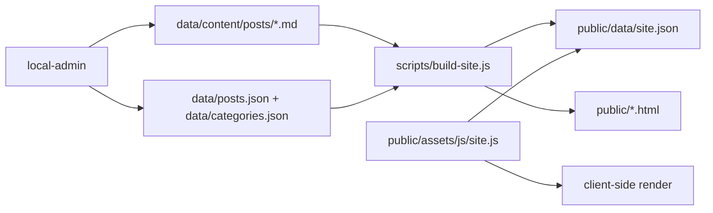

# OwO Blog Design

## 目标

OwO Blog 是一个部署到 GitHub Pages 的静态个人博客，同时提供仅本地可用的内容管理工具。

## 当前架构

- 公开站点最小化：GitHub Pages 的发布根目录是 `public/`，其中只保留 `index.html`、`post.html`、`about.html`、`404.html` 等少数入口文件。
- JSON 数据驱动：公开站点内容统一由 `public/data/site.json` 提供，首页、文章页和关于页均由浏览器端渲染。
- 公开资源集中：公开 CSS、JS、图片统一位于 `public/assets/`。
- 内容源与发布产物分离：本地写作源位于 `data/content/posts/*.md`，构建后合并进 `public/data/site.json`。
- 本地工具隔离：`local-admin/` 只用于本地管理，不发布到 GitHub Pages。

## 目录约定

```text
public/
  index.html           公开首页入口
  post.html            文章页入口，按 slug 渲染
  about.html           关于页入口
  404.html             404 与旧文章链接跳转入口
  assets/              公开 CSS / JS / IMG
  data/site.json       公开站点 JSON 数据
data/
  content/posts/       本地 Markdown 写作源
  posts.json           本地文章元数据
  categories.json      本地分类元数据
local-admin/manage/    本地管理面板
local-admin/publish/   本地文章发布面板
scripts/               构建、迁移与维护脚本
docs/                  工程文档
```

## 数据流



## 发布边界

GitHub Pages 只发布 `public/` 目录。

`local-admin/`、`data/`、`scripts/` 与 `docs/` 都是仓库内开发资产，不进入 Pages 发布产物。
